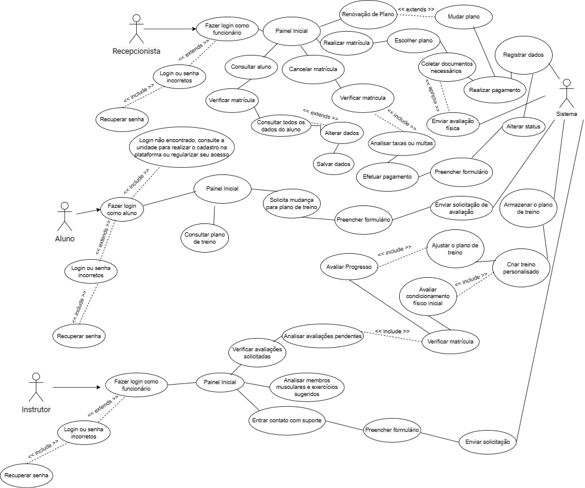

# Especificações do Projeto

Pré-requisitos: <a href="1-Documentação de Contexto.md"> Documentação de Contexto</a>

Definição do problema e ideia de solução a partir da perspectiva do usuário. É composta pela definição do  diagrama de personas, histórias de usuários, requisitos funcionais e não funcionais além das restrições do projeto.

Apresente uma visão geral do que será abordado nesta parte do documento, enumerando as técnicas e/ou ferramentas utilizadas para realizar a especificações do projeto

## Personas

Personas

> **Links Úteis**:
> - [Rock Content](https://rockcontent.com/blog/personas/)
> - [Hotmart](https://blog.hotmart.com/pt-br/como-criar-persona-negocio/)
> - [O que é persona?](https://resultadosdigitais.com.br/blog/persona-o-que-e/)
> - [Persona x Público-alvo](https://flammo.com.br/blog/persona-e-publico-alvo-qual-a-diferenca/)
> - [Mapa de Empatia](https://resultadosdigitais.com.br/blog/mapa-da-empatia/)
> - [Mapa de Stalkeholders](https://www.racecomunicacao.com.br/blog/como-fazer-o-mapeamento-de-stakeholders/)
>
Lembre-se que você deve ser enumerar e descrever precisamente e personalizada todos os clientes ideais que sua solução almeja.

## Histórias de Usuários

Com base na análise das personas forma identificadas as seguintes histórias de usuários:

> **Links Úteis**:
> - [Histórias de usuários com exemplos e template](https://www.atlassian.com/br/agile/project-management/user-stories)
> - [Como escrever boas histórias de usuário (User Stories)](https://medium.com/vertice/como-escrever-boas-users-stories-hist%C3%B3rias-de-usu%C3%A1rios-b29c75043fac)
> - [User Stories: requisitos que humanos entendem](https://www.luiztools.com.br/post/user-stories-descricao-de-requisitos-que-humanos-entendem/)
> - [Histórias de Usuários: mais exemplos](https://www.reqview.com/doc/user-stories-example.html)
> - [9 Common User Story Mistakes](https://airfocus.com/blog/user-story-mistakes/)

## Modelagem do Processo de Negócio 

### Análise da Situação Atual

Apresente aqui os problemas existentes que viabilizam sua proposta. Apresente o modelo do sistema como ele funciona hoje. Caso sua proposta seja inovadora e não existam processos claramente definidos, apresente como as tarefas que o seu sistema pretende implementar são executadas atualmente, mesmo que não se utilize tecnologia computacional. 

### Descrição Geral da Proposta

Apresente aqui uma descrição da sua proposta abordando seus limites e suas ligações com as estratégias e objetivos do negócio. Apresente aqui as oportunidades de melhorias.

### Processo 1 – NOME DO PROCESSO

Apresente aqui o nome e as oportunidades de melhorias para o processo 1. Em seguida, apresente o modelo do processo 1, descrito no padrão BPMN. 

### Processo 2 – NOME DO PROCESSO

Apresente aqui o nome e as oportunidades de melhorias para o processo 2. Em seguida, apresente o modelo do processo 2, descrito no padrão BPMN.

## Indicadores de Desempenho

Apresente aqui os principais indicadores de desempenho e algumas metas para o processo. Atenção: as informações necessárias para gerar os indicadores devem estar contempladas no diagrama de classe. Colocar no mínimo 5 indicadores. 

Usar o seguinte modelo: 

Obs.: todas as informações para gerar os indicadores devem estar no diagrama de classe a ser apresentado a posteriori. 

## Requisitos

As tabelas que se seguem apresentam os requisitos funcionais e não funcionais que detalham o escopo do projeto. Para determinar a prioridade de requisitos, aplicar uma técnica de priorização de requisitos e detalhar como a técnica foi aplicada.

### Requisitos Funcionais

|ID    | Descrição do Requisito  | Prioridade |
|------|-----------------------------------------|----|
| RF-01 | Realizar cadastro/login na plataforma como aluno ou funcionário | Alta | 
| RF-02 | Recuperar senha | Alta |
| RF-03 | Consultar e alterar dados do aluno | Média |
| RF-04 | Registro de Matrícula | Alta |
| RF-05 | Consultar plano de treino do aluno e solicitar mudança se necessário | Média |
| RF-06 | Avaliar progresso do aluno e realizar condicionamento físico se necessário | Média |
| RF-07 | Processar o cancelamento da matrícula do aluno | Média |
| RF-08 | Notificar a recepcionista quando o plano do aluno estiver prestes a expirar e oferecer opções de renovação | Média |
| RF-09 | Entrar em contato com suporte | Baixa | 
| RF-10 | Verificar o status do aluno através da matrícula antes de processar qualquer solicitação | Alta |

### Requisitos não Funcionais

|ID     | Descrição do Requisito  |Prioridade |
|-------|-------------------------|----|
| RNF-01 | O sistema deve ser rápido e responsivo | Alta |
| RNF-02 | Criar uma interface de usuário intuitiva e fácil de usar, minimizando a curva de aprendizado para os usuários | Alta |
| RNF-03 | Projetar o sistema de forma que ele possa ser escalado facilmente à medida que o número de usuários e atividades aumenta | Alta |
| RNF-04 | O sistema deve ser estável e confiável, minimizando o tempo de inatividade não planejado | Alta |
| RNF-05 | Permitir que os usuários personalizem seus planos de treino de acordo com suas necessidades e objetivos | Média |
| RNF-06 | Facilitar a manutenção do sistema por meio de uma arquitetura bem organizada e documentação abrangente | Alta |
| RNF-07 | Ter a capacidade de realizar atualizações e melhorias regulares no sistema | Alta |
| RNF-08 | Garantir que o sistema possa ser integrado a sistemas de gestão de academias ou outras ferramentas que as academias já utilizem | Alta |
| RNF-09 | Manter tempos de resposta curtos, especialmente durante a navegação no aplicativo e ao visualizar detalhes dos planos de treino | Alta |
| RNF-10 | Possuir um mecanismo de busca eficiente permitindo que os usuários encontrem informações facilmente | Média |

## Restrições

O projeto está restrito pelos itens apresentados na tabela a seguir.

|ID| Restrição                                             |
|--|-------------------------------------------------------|
|RE-01| Restrição de Segurança - Todos os dados do usuário devem ser armazenados de forma segura para proteger a privacidade dos usuários. Isso é especialmente importante para informações sensíveis, como detalhes de contato e informações de pagamento |
|RE-02| Restrição de Acessibilidade - O sistema deve ser facilmente acessível e utilizável por todos os usuários, independentemente de suas habilidades físicas ou tecnológicas. Isso pode envolver a adesão a diretrizes de acessibilidade na web e a inclusão de recursos como tamanhos de texto ajustáveis e opções de contraste de cores |
|RE-03| Restrição de Manutenção - O sistema deve ser projetado de forma a facilitar atualizações e manutenção regulares. Isso é crucial para garantir que o sistema continue a funcionar de maneira eficaz e eficiente, mesmo à medida que novas atualizações de software são lançadas e novos equipamentos de academia são introduzidos |

 
Enumere as restrições à sua solução. Lembre-se de que as restrições geralmente limitam a solução candidata.
## Diagrama de Casos de Uso 

Figura 1 - Diagrama de Casos de Uso - Descrição das funções e escopo do sistema. 

# Matriz de Rastreabilidade

A matriz de rastreabilidade é uma ferramenta usada para facilitar a visualização dos relacionamento entre requisitos e outros artefatos ou objetos, permitindo a rastreabilidade entre os requisitos e os objetivos de negócio. 

A matriz deve contemplar todos os elementos relevantes que fazem parte do sistema, conforme a figura meramente ilustrativa apresentada a seguir.

> **Links Úteis**:
> - [Artigo Engenharia de Software 13 - Rastreabilidade](https://www.devmedia.com.br/artigo-engenharia-de-software-13-rastreabilidade/12822/)
> - [Verificação da rastreabilidade de requisitos usando a integração do IBM Rational RequisitePro e do IBM ClearQuest Test Manager](https://developer.ibm.com/br/tutorials/requirementstraceabilityverificationusingrrpandcctm/)
> - [IBM Engineering Lifecycle Optimization – Publishing](https://www.ibm.com/br-pt/products/engineering-lifecycle-optimization/publishing/)

# Gerenciamento de Projeto

De acordo com o PMBoK v6 as dez áreas que constituem os pilares para gerenciar projetos, e que caracterizam a multidisciplinaridade envolvida, são: Integração, Escopo, Cronograma (Tempo), Custos, Qualidade, Recursos, Comunicações, Riscos, Aquisições, Partes Interessadas. Para desenvolver projetos um profissional deve se preocupar em gerenciar todas essas dez áreas. Elas se complementam e se relacionam, de tal forma que não se deve apenas examinar uma área de forma estanque. É preciso considerar, por exemplo, que as áreas de Escopo, Cronograma e Custos estão muito relacionadas. Assim, se eu amplio o escopo de um projeto eu posso afetar seu cronograma e seus custos.

## Gerenciamento de Tempo

Com diagramas bem organizados que permitem gerenciar o tempo nos projetos, o gerente de projetos agenda e coordena tarefas dentro de um projeto para estimar o tempo necessário de conclusão.

O gráfico de Gantt ou diagrama de Gantt também é uma ferramenta visual utilizada para controlar e gerenciar o cronograma de atividades de um projeto. Com ele, é possível listar tudo que precisa ser feito para colocar o projeto em prática, dividir em atividades e estimar o tempo necessário para executá-las.

## Gerenciamento de Equipe

O gerenciamento adequado de tarefas contribuirá para que o projeto alcance altos níveis de produtividade. Por isso, é fundamental que ocorra a gestão de tarefas e de pessoas, de modo que os times envolvidos no projeto possam ser facilmente gerenciados. 

## Gestão de Orçamento

Para estimar o custo do projeto, foi preciso considerar o número de horas que cada programador vai trabalhar por dia e o número de dias que serão trabalhados durante o semestre.

Vamos supor que cada programador trabalhe 2 horas por dia, 2 dias por semana. Isso dá um total de 4 horas por semana. Como o projeto tem uma duração de 5 meses, e considerando que um mês tem aproximadamente 4,33 semanas, temos um total de cerca de 22 semanas.

Portanto, o número total de horas trabalhadas por um programador será de 4 horas/semana * 22 semanas = 88 horas.

Como a equipe é composta por 5 programadores, o número total de horas trabalhadas pela equipe será de 88 horas/programador * 5 programadores = 440 horas.

Finalmente, estimamos que o custo por hora/programador é de R$ 10,00 reais, o custo total do projeto será de 440 horas * R$ 10,00 reais/hora = R$ 4.400,00 reais.
