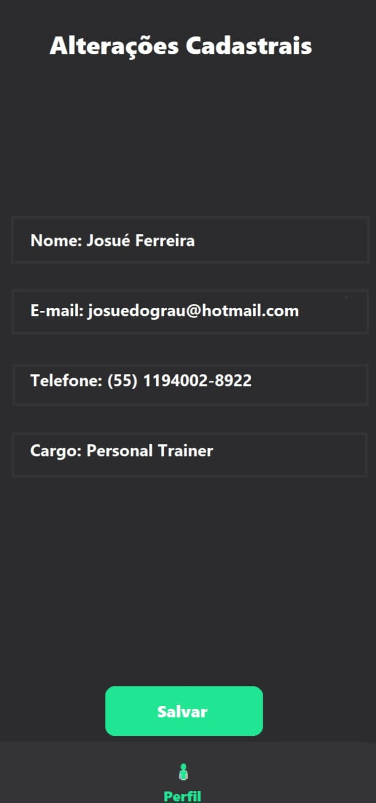
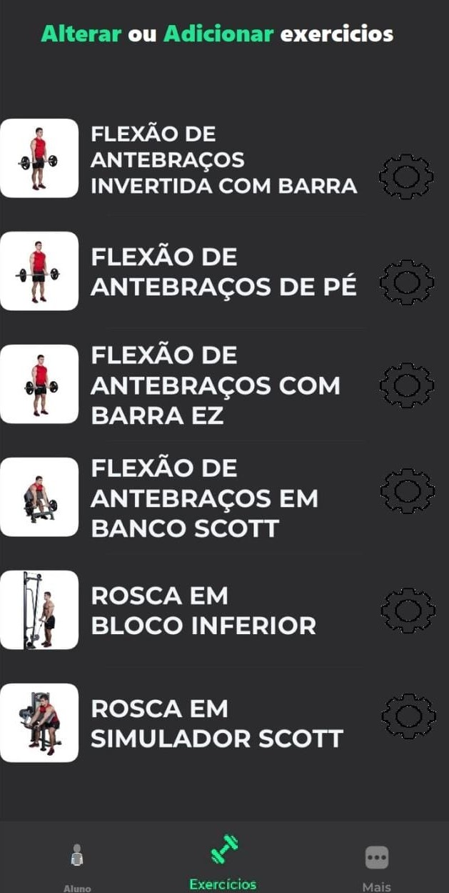
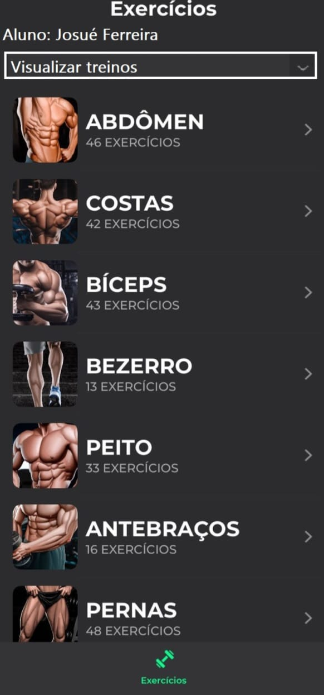
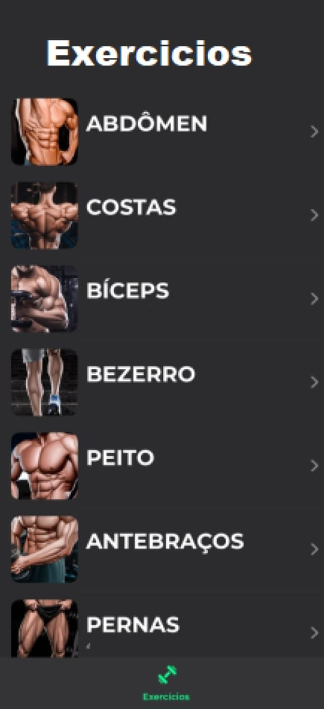
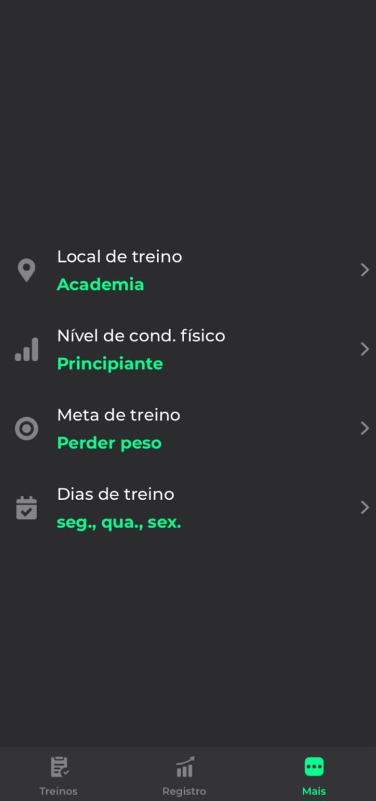

<h1>Programação de Funcionalidades</h1>

<h2>Visão Geral das Funcionalidades do Sistema (Telas)</h2>

Nesta seção, você encontrará uma descrição detalhada das telas desenvolvidas para cada funcionalidade do sistema, juntamente com o respectivo endereço (URL) e instruções de acesso.

<h3>Cadastro/Login na plataforma (RF-01)</h3>

Inicialmente, ao acessar o site, o usuário é direcionado à página inicial, onde tem a opção de iniciar o processo de criação de uma conta ou acessar a tela de login. Para usuários cadastrados, basta fornecer o e-mail e a senha correspondentes. No entanto, se o usuário ainda não estiver cadastrado, será possível registrar-se através do procedimento conduzido pelo sistema.

 
https://github.com/ICEI-PUC-Minas-PMV-ADS/ads-2024-1-e3-proj-mov-t5-fitness-app/assets/129282137/0aef374e-63d3-43cd-beb1-1bf9e624ceb6
Figura 1 - Tela inicial.
https://github.com/ICEI-PUC-Minas-PMV-ADS/ads-2024-1-e3-proj-mov-t5-fitness-app/assets/129282137/088c85fa-9ec3-4de1-be42-4f821cfcef3a
Figura 2 - Login na plataforma.
https://github.com/ICEI-PUC-Minas-PMV-ADS/ads-2024-1-e3-proj-mov-t5-fitness-app/assets/129282137/1112a769-4381-40d9-a461-a51ff0a3aa0a
Figura 3 - Cadastro na plataforma.
  

Requisitos atendidos:
- RF-01 - Realizar cadastro/login na plataforma.

<h3>Recuperação de Senha (RF-02)</h3>

Caso o usuário esqueça a senha, é possível solicitar a recuperação através da tela de login. Um e-mail será enviado para o endereço registrado com instruções detalhadas sobre como redefinir a senha.

Figura 4 - Tela para recuperação de senha.

  

Requisitos atendidos:
- RF-02 - Recuperar senha.

<h3>Alteração de Dados Cadastrais (RF-03)</h3>

A tela de perfil do aluno permite que o aluno consulte e altere seus dados pessoais. O aluno pode visualizar seus dados, mas não pode editar ou excluir seu perfil.

Figura 5 - Tela de perfil do aluno.

  

Requisitos atendidos:
- RF-03 - Consultar e alterar dados do aluno.

<h3>Alteração de Exercício (RF-04)</h3>

A tela do treinador permite que o treinador altere os exercícios dos alunos. O treinador pode visualizar os exercícios dos alunos, mas não pode editar ou excluir os exercícios.

Figura 6 - Tela de alteração de exercício.

  

Requisitos atendidos:
- RF-04 - Alteração de exercício.

<h3>Consulta de Exercícios dos Alunos (RF-05)</h3>

A tela de consulta de exercícios permite que o treinador consulte os exercícios dos alunos. O treinador pode visualizar os exercícios dos alunos, mas não pode editar ou excluir os exercícios.

Figura 7 - Tela de consulta de exercícios.

  

Requisitos atendidos:
- RF-05 - Consulta de exercícios dos alunos.

<h3>Criação de Plano de Treino (RF-06)</h3>

A tela de criação de plano de treino permite que o treinador crie um plano de treino para os alunos com base nos grupos musculares. Além disso, logo após o cadastro, o sistema deve perguntar ao aluno sobre seu condicionamento físico e a frequência semanal de treinos. Essas informações serão usadas para criar um plano de treino inicial.

Figura 8 - Tela de criação de plano de treino.

Figura 9 - Tela de pergunta sobre condicionamento físico.

Figura 10 - Tela de pergunta sobre frequência semanal.

  

Requisitos atendidos:
- RF-06 - Criação de plano de treino.

<h3>Registro de Matrícula (RF-07)</h3>

Quando um novo aluno decide se matricular, o funcionário pode registrar a matrícula do aluno na tela de matrículas. O sistema gera um número de matrícula e registra os dados do aluno.

Figura 11 - Tela de registro de matrícula.

  

Requisitos atendidos:
- RF-07 - Registro de Matrícula.

<h3>Configurações (RF-08)</h3>

A tela de configurações permite que o aluno configure o local de treino, o nível de condicionamento físico, a frequência semanal e selecione a meta de treino.

Figura 12 - Tela de configurações.

  

Requisitos atendidos:
- RF-08 - Configurações.

Instruções de acesso: 
1. Faça o download do arquivo do projeto (ZIP) ou clone do projeto no GitHub; 
2. Descompacte o arquivo em uma pasta específica; 
3. Abra o Visual Studio Code e execute o Live Server;  
4. Abra um navegador de Internet e informe a seguinte URL: 
